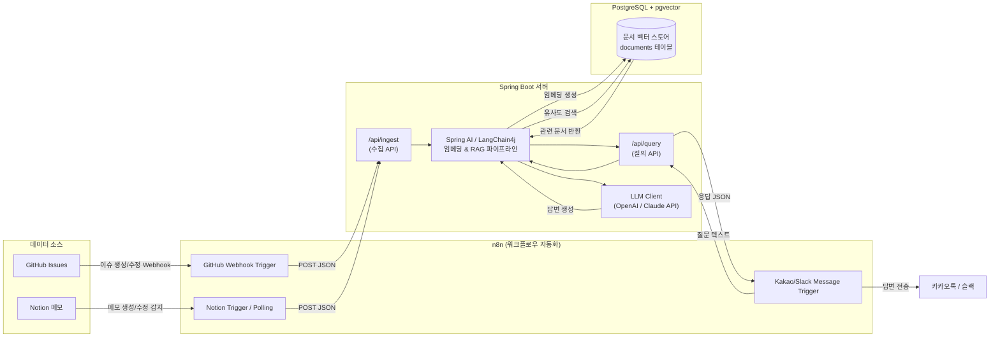

# 나만의 노션/GitHub 이슈 자동 요약 및 RAG 검색기 — 프로젝트 계획서

작성일: 2026-07-10
작성자: 유섭

---

## 1. 프로젝트 개요

### 1.1 목적

GitHub 이슈와 Notion 메모에 흩어진 개인 지식(기술 메모, 트러블슈팅 기록, 아이디어)을 자동으로 수집·임베딩하여 벡터 DB에 축적하고, 이후 카카오톡/슬랙 대화로 자연어 질의만 하면 과거 기록을 RAG(Retrieval-Augmented Generation) 방식으로 정확히 찾아 답변해주는 개인용 지식 검색 시스템을 구축한다.

### 1.2 배경 문제

- GitHub 이슈, Notion 메모가 늘어날수록 "그때 그거 어떻게 했더라" 하는 검색 비용이 커짐.
- 단순 키워드 검색은 표현이 다르면(동의어, 문맥) 놓치는 경우가 많음 → 의미 기반 검색(임베딩) 필요.
- 매번 GitHub/Notion을 열어 뒤지는 대신, 평소 쓰는 메신저(카카오톡/슬랙)에서 바로 질문하고 싶음.

### 1.3 핵심 가치

- **자동 수집**: 이슈/메모 작성 시 별도 조작 없이 자동으로 저장됨.
- **의미 기반 검색**: 정확한 키워드를 몰라도 질문의 의도로 검색됨.
- **대화형 접근**: 개발 환경을 열지 않고 메신저에서 바로 답을 받음.

---

## 2. 전체 아키텍처



### 2.1 컴포넌트 역할

| 컴포넌트 | 역할 |
|---|---|
| n8n | GitHub/Notion 이벤트 감지, 카카오톡/슬랙 메시지 수신·응답, Spring Boot와의 연동 허브 |
| Spring Boot | 비즈니스 로직, 수집/질의 API 제공, Spring AI 오케스트레이션 |
| Spring AI (or LangChain4j) | 텍스트 청킹, 임베딩 생성 호출, 벡터 검색, 프롬프트 조립 |
| PostgreSQL + pgvector | 임베딩 벡터 + 원문 메타데이터 저장소 |
| LLM (OpenAI/Claude API) | 임베딩 생성 및 최종 답변 생성 |

> Spring AI와 LangChain4j는 둘 다 Java 진영의 LLM 오케스트레이션 라이브러리로, 동시에 둘 다 쓸 필요는 없다. Spring Boot 프로젝트라면 스타터 의존성만 추가하면 되는 **Spring AI**를 1순위로 권장하고, 커스텀 체인/에이전트 구성이 더 필요해지면 LangChain4j로 확장을 검토한다.

---

## 3. 상세 시나리오 플로우

### 3.1 시나리오 A — 데이터 수집 (Ingest)

1. 유섭이 GitHub 이슈를 작성하거나, Notion 페이지에 메모를 남김.
2. n8n이 GitHub Webhook(issues 이벤트) 또는 Notion API 폴링(주기적 변경 감지)으로 이를 캐치.
3. n8n이 원문, 출처(github/notion), 제목, URL, 작성 시각 등을 JSON으로 정리하여 Spring Boot의 `POST /api/ingest`로 전송.
4. Spring Boot가 요청을 받아:
   - 텍스트를 적절한 크기로 청킹(chunking).
   - Spring AI의 `EmbeddingModel`을 통해 각 청크를 벡터로 변환.
   - `VectorStore`(pgvector 구현체)에 벡터 + 원문 + 메타데이터 저장.
5. 저장 완료 응답을 n8n에 반환 (성공/실패 로깅).

### 3.2 시나리오 B — 질의 (RAG Query)

1. 유섭이 카카오톡 오픈빌더(또는 슬랙 슬래시 커맨드/멘션)로 질문 전송.
   예: "내가 저번에 메모했던 대용량 트래픽 처리 방법이 뭐였지?"
2. n8n이 카카오톡/슬랙 메시지를 수신하여 질문 텍스트를 추출, `POST /api/query`로 Spring Boot에 전달.
3. Spring Boot의 RAG 파이프라인:
   - 질문을 임베딩.
   - pgvector에서 코사인 유사도 기반 Top-K 유사 문서 검색.
   - 검색된 문서(원문 청크 + 출처)를 컨텍스트로 프롬프트 조립.
   - LLM에 "컨텍스트 기반으로만 답하라"는 지시와 함께 질의 → 답변 생성.
4. 답변과 원본 출처(GitHub 이슈 링크 또는 Notion 페이지 링크)를 함께 n8n에 응답.
5. n8n이 카카오톡/슬랙으로 최종 메시지를 전송 (예: "답변: ... \n출처: [이슈 #42]").

---

## 4. 기술 스택

| 영역 | 기술 |
|---|---|
| 자동화/연동 | n8n |
| 백엔드 | Spring Boot 3.x (Java 17+) |
| AI 오케스트레이션 | Spring AI (1순위) / LangChain4j (대안·확장) |
| 벡터 DB | PostgreSQL + pgvector extension |
| 임베딩/LLM | OpenAI (text-embedding-3-small, gpt-4o-mini) 또는 Claude API |
| 메신저 연동 | 카카오톡 오픈빌더(챗봇 API) 또는 Slack API (n8n 노드 활용) |
| 인프라(선택) | Docker Compose (Spring Boot + PostgreSQL 로컬 구동), ngrok(로컬 웹훅 테스트) |

---

## 5. 데이터 모델 (PostgreSQL + pgvector)

```sql
-- pgvector 확장 활성화
CREATE EXTENSION IF NOT EXISTS vector;

CREATE TABLE documents (
    id              BIGSERIAL PRIMARY KEY,
    source          VARCHAR(20)   NOT NULL,   -- 'github' | 'notion'
    source_id       VARCHAR(255)  NOT NULL,   -- 이슈 번호 / 노션 페이지 ID
    title           TEXT,
    url             TEXT,
    content         TEXT          NOT NULL,   -- 청크 원문
    embedding       VECTOR(1536)  NOT NULL,   -- 임베딩 모델 차원에 맞춰 조정
    created_at      TIMESTAMP     DEFAULT now(),
    updated_at      TIMESTAMP     DEFAULT now()
);

-- 유사도 검색 성능을 위한 인덱스 (IVFFlat 또는 HNSW)
CREATE INDEX ON documents USING hnsw (embedding vector_cosine_ops);
```

> Spring AI의 `PgVectorStore`를 사용하면 위 테이블 스키마와 유사한 구조를 자동 생성해주므로, 초기에는 라이브러리 기본 스키마를 그대로 활용하고 필요 시 커스터마이징하는 방식을 권장한다.

---

## 6. API 명세 (초안)

### 6.1 `POST /api/ingest`

수집용 엔드포인트. n8n이 GitHub/Notion 이벤트 발생 시 호출.

```json
{
  "source": "github",
  "sourceId": "42",
  "title": "대용량 트래픽 처리 시 캐시 전략",
  "url": "https://github.com/user/repo/issues/42",
  "content": "Redis 캐시를 앞단에 두고 ..."
}
```

응답: `201 Created`, 저장된 문서 ID 및 청크 개수.

### 6.2 `POST /api/query`

RAG 질의용 엔드포인트. n8n이 카카오톡/슬랙 질문 수신 시 호출.

```json
{
  "question": "내가 저번에 메모했던 대용량 트래픽 처리 방법이 뭐였지?",
  "topK": 5
}
```

응답:

```json
{
  "answer": "Redis 캐시를 앞단에 두고 TTL을 짧게 가져가는 방식을 메모하셨습니다.",
  "sources": [
    { "title": "대용량 트래픽 처리 시 캐시 전략", "url": "https://github.com/user/repo/issues/42" }
  ]
}
```

---

## 7. 개발 로드맵 (마일스톤)

### Phase 0 — 환경 세팅 (예상 1~2일)
- Docker Compose로 PostgreSQL + pgvector 로컬 구동
- Spring Boot 프로젝트 초기화 (Spring AI 스타터, JPA/JDBC 의존성 추가)
- 로컬 개발용 n8n 인스턴스 구동 (Docker)

### Phase 1 — MVP: 수집 파이프라인 (예상 3~5일)
- `/api/ingest` API 구현 (청킹 + 임베딩 + 저장)
- n8n에서 GitHub Webhook → Spring Boot 연동 (ngrok으로 로컬 테스트)
- Notion API 연동은 후순위로 미루고, 우선 GitHub 이슈만으로 파이프라인 검증

### Phase 2 — MVP: 검색 파이프라인 (예상 3~5일)
- `/api/query` API 구현 (벡터 검색 + 프롬프트 조립 + LLM 호출)
- Postman/curl로 질의 테스트, 답변 품질 및 출처 정확도 검증

### Phase 3 — 메신저 연동 (예상 2~3일)
- Slack 연동 우선 구축 (n8n Slack 노드가 카카오톡보다 간단함)
- 슬랙 슬래시 커맨드 또는 멘션 → n8n → Spring Boot → 슬랙 응답 확인

### Phase 4 — Notion 연동 확장 (예상 2~3일)
- n8n Notion Trigger(또는 폴링) 구성
- Notion 페이지 블록 → 텍스트 추출 로직 추가

### Phase 5 — 카카오톡 연동 (예상 3~4일, 난이도 높음)
- 카카오 i 오픈빌더 챗봇 생성 및 스킬 서버 연동
- n8n 웹훅과 카카오 스킬 서버 스펙 맞추기 (카카오는 5초 이내 응답 제약 있음 → 비동기 콜백 방식 검토 필요)

### Phase 6 — 품질 개선 (지속)
- 청킹 전략 튜닝 (문단/토큰 기준)
- 유사도 검색 정확도 개선 (메타데이터 필터링, 하이브리드 검색 등)
- 답변에 출처 인용 형식 개선
- 중복/업데이트된 문서 재임베딩 처리 (같은 이슈가 수정될 때 기존 벡터 갱신)

---

## 8. 리스크 및 고려사항

- **카카오톡 연동 난이도**: 카카오 i 오픈빌더는 응답 시간 제약(5초)이 있어 LLM 응답 지연 시 타임아웃 발생 가능 → 비동기 응답(콜백 URL) 구조 설계 필요. 초기 구현은 Slack으로 먼저 검증 후 확장하는 것을 권장.
- **비용 관리**: 임베딩 생성과 LLM 호출 모두 API 과금 대상 → 개인 토이 프로젝트 규모에서는 저비용 모델(text-embedding-3-small, gpt-4o-mini 등) 사용 권장.
- **문서 갱신 처리**: GitHub 이슈나 Notion 메모가 수정되었을 때 기존 벡터를 그대로 둘지, 재임베딩할지에 대한 정책 필요 (source + sourceId 기준으로 upsert 권장).
- **보안**: 개인 API 키(LLM, GitHub, Notion, 카카오/슬랙 토큰)는 환경 변수 또는 Spring Boot의 `application.yml` + 외부 시크릿 관리로 분리.
- **n8n 노출**: 웹훅을 외부에서 받으려면 n8n/Spring Boot가 공인 접근 가능해야 함 → 초기엔 ngrok, 이후엔 소규모 VPS나 무료 티어 클라우드(Railway, Fly.io 등) 배포 검토.

---

## 9. 향후 확장 아이디어

- 슬랙/카카오톡 답변에 "관련 이슈 3개까지 더 보기" 같은 인터랙티브 옵션 추가
- 주간 자동 요약 리포트 (한 주간 쌓인 이슈/메모를 요약해서 매주 월요일 슬랙으로 발송) — n8n 스케줄 트리거로 구현 가능
- 태그/카테고리 자동 분류 (LLM으로 이슈 성격 분류 후 메타데이터에 저장, 필터 검색 지원)
- 멀티 소스 확장 (Jira, Confluence, 개인 블로그 등)
